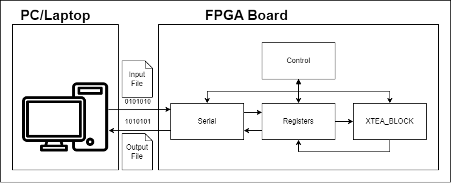

# tubes-sisdig-2023

#### KELOMPOK 10
- Raphael Nathaniel Hartanto (13222060)
- Muhammad Yusuf Al Azmi (13222062)
- Zulfan Andria Putranto (13222063)
- Muhammad Eiros Dante (1322064)
- Ihsan Hidayat Rafi (13222065)
- Goldwin Sonick Wijaya Thaha (13222067)

## XTEA ENCRYPTION
Sistem Enkripsi dengan Algoritma XTEA. Pada tugas besar ini, kelompok 10 ingin membuat suatu sistem yang dapat melakukan enkripsi/dekripsi terhadap suatu file/dokumen. File/dokumen yang ada di PC/Laptop dikirim secara serial ke FPGA untuk dienkripsi dan dikembalikan hasil enkrips/dekripsi secara serial ke PC/Laptop.

## FPGA Board
Dev Board: RZ-EasyFPGA A2.2

Chip: Altera Cyclone IV EP4cE6E22C8N

Spesifikasi 
[(1)](https://pdf1.alldatasheet.com/datasheet-pdf/view/508700/ALTERA/EP4CE6E22C8N.html)
[(2)](https://makerselectronics.com/product/rz-easy-fpga-a2-2-development-board):
- Clock Frequency: 402 MHz
- SDRAM: 64Mbit = 8MB
- I/O Speed: -